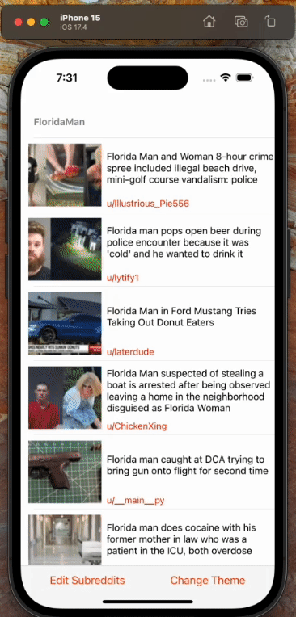
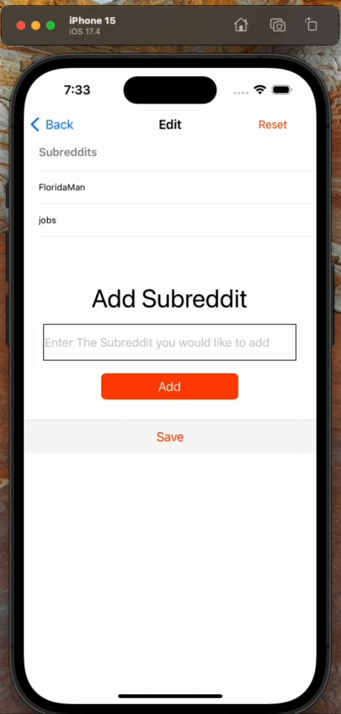
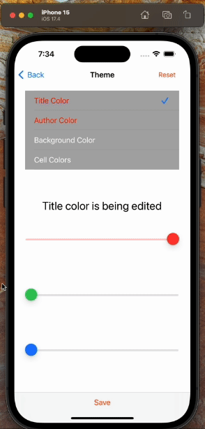
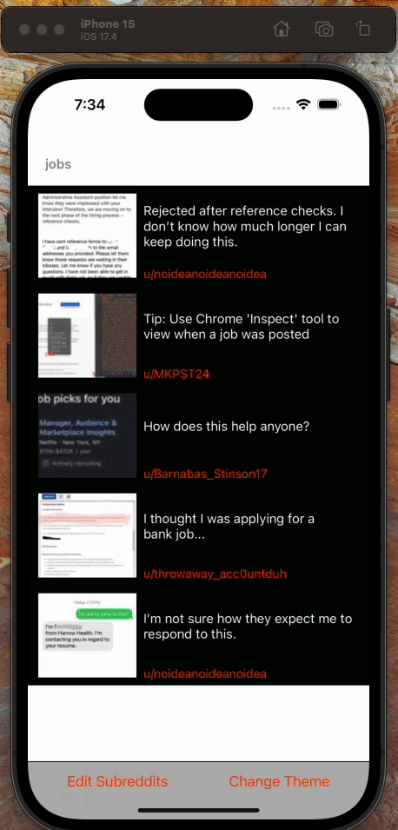

# Reddit-Viewer
iOS application that allows users to browse posts from various subreddits. Users can customize the appearance of the app by selecting different theme colors for titles, authors, backgrounds, and cells.

## Features
- View posts from multiple subreddits
- Customize theme colors
- Save favorite subreddits
  
## Usage
- Run the project in Xcode.
- Browse through the list of posts from the default subreddit "FloridaMan".
- Tap on the "add" button to add new subreddits.
- Customize theme colors by navigating to the "theme" tab.
- Save your preferences by tapping the "Save" button.
  
## Demo
### Browse Subreddits 

### Add Subreddits 

### Delete Subreddits 

### Reset Subreddits 

### Change Theme

### Reset Theme 

## Technologies Used
- **Swift**: The application is built using the Swift programming language, which is specifically designed for iOS, macOS, watchOS, and tvOS development.
- **UIKit Framework**: UIKit is used for building the user interface of the application. It provides essential components for creating iOS apps, such as views, view controllers, and controls.
- **Foundation Framework**: The Foundation framework provides a base layer of functionality for apps, including data storage, networking, and file management. It's used in this project for tasks like data serialization, networking, and UserDefaults storage.
- **Xcode**: Xcode is the integrated development environment (IDE) for macOS used to develop applications for Apple platforms. It provides tools for coding, testing, debugging, and deploying iOS apps.
- **JSONSerialization**: JSONSerialization is used for parsing JSON data retrieved from the Reddit API. It provides methods for converting JSON data to Swift objects.
- **URLSession**: URLSession is used for making network requests to the Reddit API. It handles tasks like data downloading and uploading in the background.
- **UserDefaults**: UserDefaults is used for storing user preferences and settings, such as theme colors and favorite subreddits. It provides a simple interface for storing small amounts of data persistently.
- **NSKeyedArchiver/NSKeyedUnarchiver**: These classes are used for archiving and unarchiving UIColor objects to and from Data objects. This allows for saving and retrieving UIColors from UserDefaults.

## Contributing 
Contributions are welcome! 

### You can contribute by:
-  Reporting bugs
-  Suggesting new features
-  Submitting pull requests to improve the codebase
